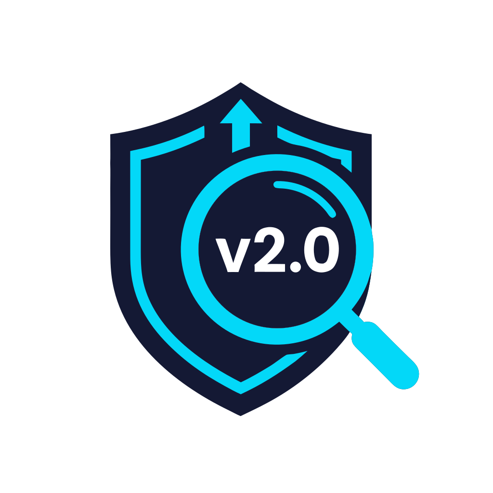

<p align="center">
  
</p>

<h1 align="center">version-sentinel</h1>

<p align="center">Claude Code plugin that <strong>hard-blocks</strong> dependency additions, bumps, and downgrades until a fresh, source-cited version check is recorded.</p>

> If Claude tries to add `"lodash": "^4.17.21"` without looking up the latest version first, the tool call is rejected with exit 2. Claude must run `WebSearch`, then `/vs-record`, then retry. Five ecosystems supported in v0.1.

## Why

LLM-assisted coding silently ships whatever version the model remembers from its training data. For packages with frequent releases or known compromised versions, that's unacceptable. `version-sentinel` inserts a mandatory "check the registry" step — without stopping you from pinning an old version on purpose.

## Supported ecosystems (v0.1)

| File | Ecosystem | Registry |
|------|-----------|----------|
| `package.json` | npm/pnpm/yarn/bun | registry.npmjs.org |
| `requirements*.txt`, `constraints*.txt` | pip | pypi.org |
| `pyproject.toml` | PEP 621 + Poetry + uv | pypi.org |
| `Cargo.toml` | Rust | crates.io |
| `*.csproj`, `*.fsproj`, `*.vbproj` | .NET | api.nuget.org |

Covers `Edit`, `Write`, `MultiEdit`, and `Bash` install commands (`npm install`, `pip install`, `poetry add`, `uv add`, `cargo add`, `dotnet add package`).

## Install

```
/plugin marketplace add DanielKiska/version-sentinel
/plugin install version-sentinel@version-sentinel-marketplace
```

## Prerequisites

- `bash`, `jq`, `curl`, `python3` (3.11+, for `tomllib`) on `PATH`
- Windows: Git Bash bundles `bash`/`jq`/`curl`; install Python 3.13 separately.

## How it works

1. Claude tries to add/bump a dep (`Edit package.json`, `npm install X@Y`, ...)
2. PreToolUse hook fires, exits 2 with stderr:
   ```
   BLOCKED: version-sentinel.
   Package: lodash (npm). Version: 4.17.21.
   No fresh version check on record.
   ```
3. Claude runs `WebSearch "lodash latest version site:npmjs.com"`
4. Claude invokes `/vs-record npm lodash 4.17.21 https://www.npmjs.com/package/lodash`
5. Claude retries — hook finds fresh entry, lets the call through.

## Commands

- `/vs-record <ecosystem> <pkg> <version> <source>` — record a version check
- `/check-versions` — audit manifests against upstream registries

## Escape hatches

| Case | How |
|------|-----|
| Deliberate old-version pin | `/vs-record npm pkg 1.0.0 "intentional: CVE fix deferred"` |
| Throwaway session | `export VS_DISABLE=1` |
| Private/forked package | Add `ecosystem:pkg` to `.version-sentinel/ignore` |
| No WebSearch (non-US) | Use WebFetch URL or `intentional: no-websearch-region` |

## Sidecar file

State: `<project-root>/.version-sentinel/checks.json`. Auto-gitignored on first write.

## Uninstall

```
/plugin uninstall version-sentinel@version-sentinel-marketplace
/plugin marketplace remove version-sentinel-marketplace
```

## License

MIT — see [LICENSE](./LICENSE).
