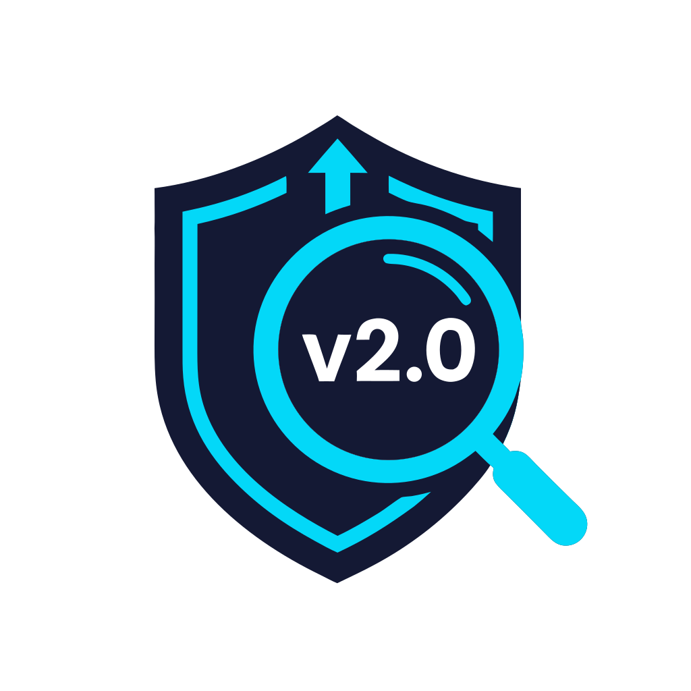

<p align="center">
  
</p>

<h1 align="center">version-sentinel</h1>

<p align="center">
  <a href="https://github.com/KSEGIT/Version-Sentinel/releases/latest"></a>
  <a href="./LICENSE"></a>
  
  
</p>

<p align="center">Claude Code plugin that <strong>hard-blocks</strong> dependency additions, bumps, and downgrades until a fresh, source-cited version check is recorded.</p>

> If Claude tries to add `"lodash": "^4.17.21"` without looking up the latest version first, the tool call is rejected with exit 2. Claude must run `WebSearch`, then `/vs-record`, then retry. Five ecosystems supported in v0.1.

**Keywords:** Claude Code, Anthropic, AI coding guardrails, LLM supply-chain security, dependency management, hallucinated package versions, npm, PyPI, Cargo, NuGet, PreToolUse hook.

## Why

LLM-assisted coding silently ships whatever version the model remembers from its training data. For packages with frequent releases or known compromised versions, that's unacceptable. `version-sentinel` inserts a mandatory "check the registry" step — without stopping you from pinning an old version on purpose.

## What it prevents

- **Hallucinated versions** — LLM picks a version that never existed or never shipped.
- **Stale defaults** — model reaches for a 2-year-old pin because training data froze there.
- **Compromised-release installs** — no guard against yanked / malicious versions without a fresh registry lookup.
- **Silent downgrades** — Claude "fixes" a CI error by reverting a package to an older vulnerable build.
- **Supply-chain drift** — no audit trail of *why* a specific version was chosen.

## How it compares

| Tool | Scope | Enforcement |
|------|-------|-------------|
| `version-sentinel` | Claude Code **PreToolUse hook** — blocks the tool call before the edit lands | Hard-fail exit 2 |
| Generic dependency-audit skills | Post-hoc scan of `package.json` / `requirements.txt` | Advisory |
| Dependabot / Renovate | Scheduled PR bot against remote registries | Async PR |

Unlike post-hoc auditors, `version-sentinel` runs **inside the agent loop** — the agent cannot merge a bad version by accident because the write itself is refused until the check is cited.

## Supported ecosystems (v0.1)

| File | Ecosystem | Registry |
|------|-----------|----------|
| `package.json` | npm/pnpm/yarn/bun | registry.npmjs.org |
| `requirements*.txt`, `constraints*.txt` | pip | pypi.org |
| `pyproject.toml` | PEP 621 + Poetry + uv | pypi.org |
| `Cargo.toml` | Rust | crates.io |
| `*.csproj`, `*.fsproj`, `*.vbproj` | .NET | api.nuget.org |

Covers `Edit`, `Write`, `MultiEdit`, and `Bash` install commands (`npm install`, `pip install`, `poetry add`, `uv add`, `cargo add`, `dotnet add package`).

## Install

```
/plugin marketplace add https://github.com/KSEGIT/Version-Sentinel.git
/plugin install version-sentinel@version-sentinel-marketplace
```

> The `owner/repo` shorthand (`KSEGIT/Version-Sentinel`) resolves to an SSH clone URL and requires GitHub SSH keys. Use the full HTTPS URL above to clone anonymously.

## Multi-agent support

One repo, six agent platforms. The same hook scripts and sidecar state back every integration; each platform gets its own thin adapter (manifest, hook wiring, commands).

| Platform | Install / enable |
|----------|------------------|
| Claude Code | `/plugin marketplace add https://github.com/KSEGIT/Version-Sentinel.git` → `/plugin install version-sentinel@version-sentinel-marketplace` |
| z.ai (GLM Coding Plan / ZCode) | Uses the Claude Code plugin format — same install as Claude Code above (ZCode embeds the Claude Code runtime; GLM Coding Plan runs inside Claude Code) |
| Kimi Code | `/plugins install https://github.com/KSEGIT/Version-Sentinel` (or a local path) |
| GitHub Copilot in VS Code | Files under `.github/` + `.agents/skills/` — works when this repo is the workspace, or copy them into yours |
| Gemini CLI | `gemini extensions install https://github.com/KSEGIT/Version-Sentinel`, then `bash ~/.gemini/extensions/version-sentinel/platforms/gemini/setup.sh` to activate hooks (see `docs/e2e-checklist.md`) |
| OpenAI Codex | `codex plugin marketplace add KSEGIT/Version-Sentinel` → `codex plugin add version-sentinel` (or legacy `.claude-plugin` marketplace compat) |
| Zed | Manual: `AGENTS.md` + `.agents/skills/` + `docs/zed.md` — static-permissions approximation; **no hook support**, so blocking is best-effort |

Platform-specific layout:

```
plugin.json, .claude-plugin/   Claude Code plugin + marketplace metadata
kimi.plugin.json, platforms/kimi/  Kimi Code plugin manifest + adapter
gemini-extension.json, GEMINI.md   Gemini CLI extension manifest + context
platforms/gemini/setup.sh        Gemini hook activation (run inside the installed extension)
commands/*.toml                Gemini CLI slash commands (/vs-record, /check-versions)
.codex-plugin/                 OpenAI Codex plugin metadata
.github/hooks|agents|prompts/  GitHub Copilot hooks, agents, prompts
.agents/skills/                Cross-tool skills (Copilot, Zed, ...)
AGENTS.md                      Cross-tool agent instructions
```

For marketplace listings and submission status per platform (what's ready, what needs an owner-submitted form), see `docs/marketplaces.md`.

## Prerequisites

- `bash`, `jq`, `curl`, `python3` (3.11+, for `tomllib`) on `PATH`
- Windows: Git Bash bundles `bash`/`jq`/`curl`; install Python 3.13 separately.

## How it works

1. Claude tries to add/bump a dep (`Edit package.json`, `npm install X@Y`, ...)
2. PreToolUse hook fires, exits 2 with stderr:
   ```
   BLOCKED: version-sentinel.
   Package: lodash (npm). Version: 4.17.21.
   No fresh version check on record.
   ```
3. Claude runs `WebSearch "lodash latest version site:npmjs.com"`
4. Claude invokes `/vs-record npm lodash 4.17.21 https://www.npmjs.com/package/lodash`
5. Claude retries — hook finds fresh entry, lets the call through.

## Commands

- `/vs-record <ecosystem> <pkg> <version> <source>` — record a version check
- `/check-versions` — audit manifests against upstream registries

## Escape hatches

| Case | How |
|------|-----|
| Deliberate old-version pin | `/vs-record npm pkg 1.0.0 "intentional: CVE fix deferred"` |
| Throwaway session | `export VS_DISABLE=1` |
| Private/forked package | Add `ecosystem:pkg` to `.version-sentinel/ignore` |
| No WebSearch (non-US) | Use WebFetch URL or `intentional: no-websearch-region` |

## Sidecar file

State: `<project-root>/.version-sentinel/checks.json`. Auto-gitignored on first write.

## Uninstall

```
/plugin uninstall version-sentinel@version-sentinel-marketplace
/plugin marketplace remove version-sentinel-marketplace
```

## FAQ

**Does this work with Claude Desktop or just Claude Code?**
Claude Code only — relies on the PreToolUse hook API exposed by the CLI.

**Does it slow Claude down?**
First touch of a package: adds one `WebSearch` + one `/vs-record` call (~5–10s). Subsequent edits to the same pin hit the cached sidecar — zero overhead.

**Can I use this for private / internal registries?**
Yes — add the `ecosystem:pkg` entry to `.version-sentinel/ignore`, or record with a justification string.

**Why not just run `npm audit` / `pip-audit`?**
Those are post-hoc. `version-sentinel` refuses the write in the first place, so the vulnerable version never enters the repo.

**Does it support Go modules, Gradle, Maven, composer, gems?**
Not in v0.1. See `docs/roadmap.md`.

## Related

- [Anthropic Claude Code](https://claude.com/claude-code)
- [Claude Code plugin docs](https://code.claude.com/docs/en/plugin-dependencies)

## License

MIT — see [LICENSE](./LICENSE).